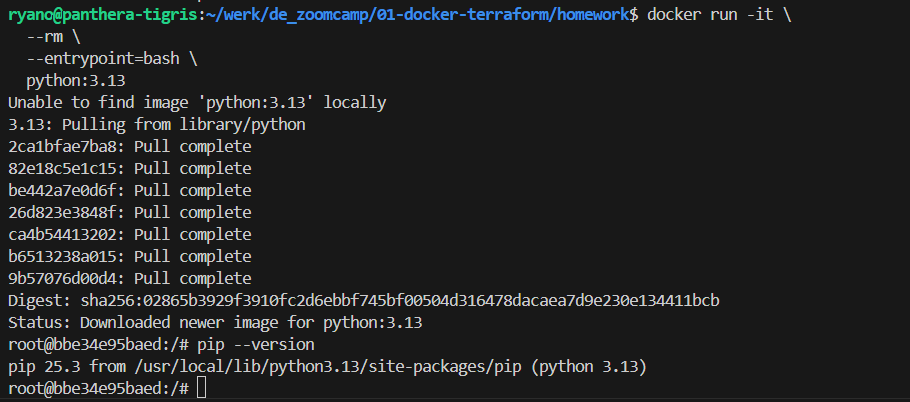
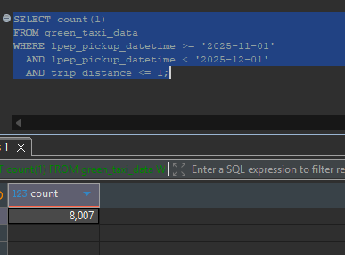
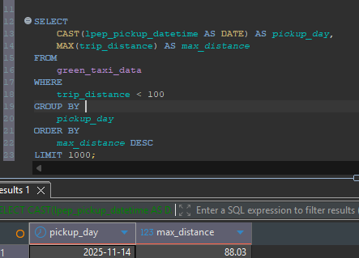
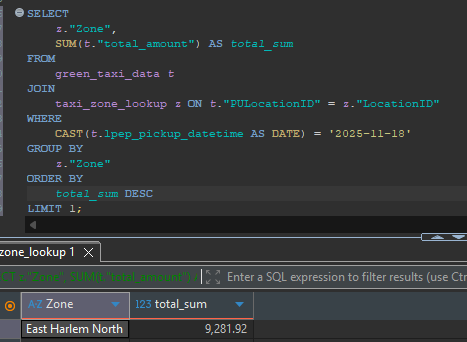

# Module 1 Homework: Docker & SQL

## Question 1. Understanding Docker images

Run docker with the `python:3.13` image. Use an entrypoint `bash` to interact with the container.

What's the version of `pip` in the image?

- **25.3** ✅
- 24.3.1
- 24.2.1
- 23.3.1

### Answer screenshot:



### command used:

```bash
  docker run -it \
    --rm \
    --entrypoint=bash \
    python:3.13

  pip --version
```

## Question 2. Understanding Docker networking and docker-compose

Given the following `docker-compose.yaml`, what is the `hostname` and `port` that pgadmin should use to connect to the postgres database?

```yaml
services:
  db:
    container_name: postgres
    image: postgres:17-alpine
    environment:
      POSTGRES_USER: "postgres"
      POSTGRES_PASSWORD: "postgres"
      POSTGRES_DB: "ny_taxi"
    ports:
      - "5433:5432"
    volumes:
      - vol-pgdata:/var/lib/postgresql/data

  pgadmin:
    container_name: pgadmin
    image: dpage/pgadmin4:latest
    environment:
      PGADMIN_DEFAULT_EMAIL: "pgadmin@pgadmin.com"
      PGADMIN_DEFAULT_PASSWORD: "pgadmin"
    ports:
      - "8080:80"
    volumes:
      - vol-pgadmin_data:/var/lib/pgadmin

volumes:
  vol-pgdata:
    name: vol-pgdata
  vol-pgadmin_data:
    name: vol-pgadmin_data
```

- **postgres:5433** ✅
- localhost:5432
- **db:5433** ✅
- postgres:5432
- db:5432

### answer:

```
The hostname is `postgres` or `db` and the port is `5433`. its clearly defined in the ports section of the docker-compose file.
```

## Question 3. Counting short trips

For the trips in November 2025 (lpep_pickup_datetime between '2025-11-01' and '2025-12-01', exclusive of the upper bound), how many trips had a `trip_distance` of less than or equal to 1 mile?

- 7,853
- **8,007** ✅
- 8,254
- 8,421

### answer screenshot:



### SQL query used:

    ```sql
      SELECT count(1)
      FROM green_taxi_data
      WHERE lpep_pickup_datetime >= '2025-11-01'
        AND lpep_pickup_datetime < '2025-12-01'
        AND trip_distance <= 1;
    ```

## Question 4. Longest trip for each day

Which was the pick up day with the longest trip distance? Only consider trips with `trip_distance` less than 100 miles (to exclude data errors).

Use the pick up time for your calculations.

- **2025-11-14** ✅
- 2025-11-20
- 2025-11-23
- 2025-11-25

#### answer screenshot:



#### SQL query used:

```sql
SELECT
    CAST(lpep_pickup_datetime AS DATE) AS pickup_day,
    MAX(trip_distance) AS max_distance
FROM
    green_taxi_data
WHERE
    trip_distance < 100
GROUP BY
    pickup_day
ORDER BY
    max_distance DESC
LIMIT 1000;
```

## Question 5. Biggest pickup zone

Which was the pickup zone with the largest `total_amount` (sum of all trips) on November 18th, 2025?

- **East Harlem North** ✅
- East Harlem South
- Morningside Heights
- Forest Hills

#### answer screenshot:



#### SQL query used:

```sql
SELECT
    z."Zone",
    SUM(t."total_amount") AS total_sum
FROM
    green_taxi_data t
JOIN
    taxi_zone_lookup z ON t."PULocationID" = z."LocationID"
WHERE
    CAST(t.lpep_pickup_datetime AS DATE) = '2025-11-18'
GROUP BY
    z."Zone"
ORDER BY
    total_sum DESC
LIMIT 1;
```

## Question 6. Largest tip

For the passengers picked up in the zone named "East Harlem North" in November 2025, which was the drop off zone that had the largest tip?

Note: it's `tip` , not `trip`. We need the name of the zone, not the ID.

- JFK Airport
- **Yorkville West** ✅
- East Harlem North
- LaGuardia Airport

#### answer screenshot:


#### SQL query used:

```sql
SELECT
    zdo."Zone" AS dropoff_zone,
    t.tip_amount
FROM
    green_taxi_data t
JOIN
    taxi_zone_lookup zpu ON t."PULocationID" = zpu."LocationID"
JOIN
    taxi_zone_lookup zdo ON t."DOLocationID" = zdo."LocationID"
WHERE
    zpu."Zone" = 'East Harlem North'
    AND t.lpep_pickup_datetime >= '2025-11-01'
    AND t.lpep_pickup_datetime < '2025-12-01'
ORDER BY
    t.tip_amount DESC
LIMIT 1;
```

## Question 7. Terraform Workflow

Which of the following sequences, respectively, describes the workflow for:

1. Downloading the provider plugins and setting up backend,
2. Generating proposed changes and auto-executing the plan
3. Remove all resources managed by terraform`

Answers:

- terraform import, terraform apply -y, terraform destroy
- teraform init, terraform plan -auto-apply, terraform rm
- terraform init, terraform run -auto-approve, terraform destroy
- **terraform init, terraform apply -auto-approve, terraform destroy** ✅
- terraform import, terraform apply -y, terraform rm
